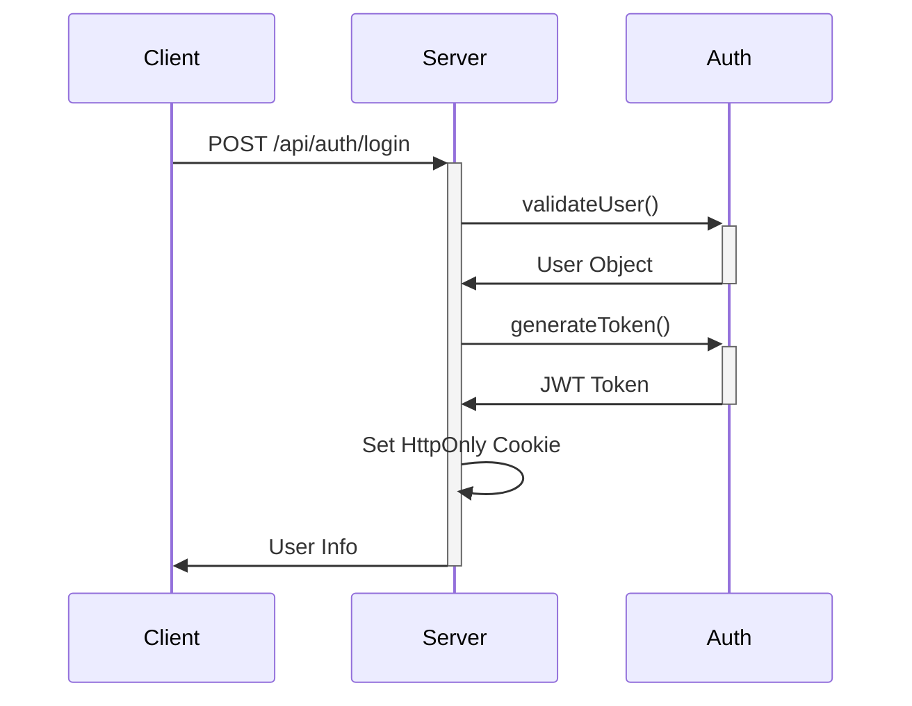

# 认证系统技术文档

## 目录
- [功能概述](#功能概述)
- [技术实现](#技术实现)
- [认证流程](#认证流程)
- [安全机制](#安全机制)
- [API 参考](#api-参考)
- [优化建议](#优化建议)

## 功能概述

系统实现了完整的用户认证功能：
- ✨ 用户注册
- 🔐 安全登录
- 🚪 用户登出
- 🔄 会话持久化（基于 JWT）
- ✅ 认证状态检查

## 技术实现

### 数据存储
- 采用本地文件系统存储用户数据 (`DATA_DIR/users.json`)
- 用户数据结构：
  ```typescript
  interface User {
    id: string
    username: string
    password: string
    createdAt: string
  }
  ```

### 认证机制
- 使用 JWT (JSON Web Token) 进行身份验证
- Token 通过 HttpOnly Cookie 安全存储
- 支持开发环境超级用户配置

## 认证流程

### 登录流程
1. 客户端发送登录请求
2. 服务端验证用户凭据
3. 生成 JWT token
4. 设置 HttpOnly Cookie
5. 返回用户基本信息



### Token 验证流程
1. 客户端请求携带 Cookie
2. 服务端验证 Token 有效性
3. 解析 Token 获取用户信息
4. 验证用户权限

## 安全机制

### Token 安全
- 使用环境变量 `JWT_SECRET` 作为签名密钥
- Token 设置 7 天有效期
- 通过 HttpOnly Cookie 防止 XSS 攻击

### Cookie 配置
```typescript
{
  httpOnly: true,
  secure: process.env.NODE_ENV === 'production',
  sameSite: 'strict',
  maxAge: 7 * 24 * 60 * 60 // 7天
}
```

## API 参考

### 登录接口
- **路径**: `/api/auth/login`
- **方法**: POST
- **请求体**:
  ```json
  {
    "username": "string",
    "password": "string"
  }
  ```
- **响应**:
  ```json
  {
    "user": {
      "id": "string",
      "username": "string"
    }
  }
  ```

### 其他接口
- 注册: `POST /api/auth/register`
- 登出: `POST /api/auth/logout`
- 状态检查: `GET /api/auth/check`

## 优化建议

### 短期优化
1. 添加密码加密存储
2. 实现 Token 刷新机制
3. 添加请求频率限制

### 长期规划
1. 数据存储升级
   - 迁移至关系型数据库
   - 引入缓存层
2. 认证机制增强
   - 实现双因素认证
   - 支持 OAuth 2.0
3. 监控与日志
   - 添加认证事件日志
   - 实现安全审计

## 注意事项
1. 确保 `JWT_SECRET` 在生产环境的安全性
2. 定期更新依赖包版本
3. 监控 Token 滥用情况